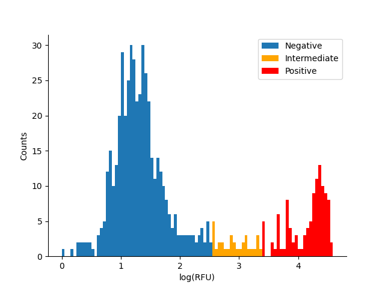
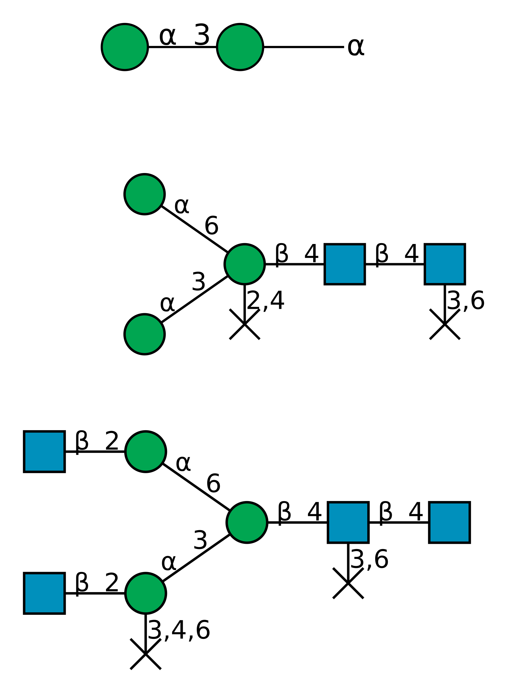
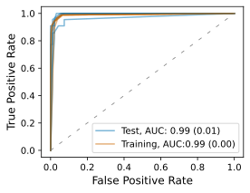

# CCARL

A repository for code associated with the "Carbohydrate Classification Accounting for Restricted Linkages" (CCARL) tool.

This tool enables identification of key motifs from glycan microarray data.

Additionally, it can also be used to classify binding to glycans with unknown binding behaviour (given a set of glycan microarray data for a given glycan-binding protein).

## __Installation & Usage__

## Docker Container

The easiest way to run the CCARL tool is to use the provided Docker container which provides easy access to the CCARL command-line scripts:

```bash
docker pull andrewguy/ccarl:v1.0.0

docker run --rm -v `pwd`:/data andrewguy/ccarl:v1.0.0 --help
```

To validate CFG data (often needed because the CFG data usually contains errors which break the glycan parsing tool):

```bash
docker run --rm -v `pwd`:/data andrewguy/ccarl:v1.0.0 validate-structures /data/tests/test_data/ConA_13799-10ug_V5.0_DATA.csv /data/ConA.validated.csv -v
```

To identify binary thresholds for binding/non-binding glycans from RFU data, saving a histogram of binding:

```bash
docker run --rm -v `pwd`:/data andrewguy/ccarl:v1.0.0 identify-binders /data/ConA.validated.csv /data/ConA.binders.csv --histogram /data/ConA_hist.png
```

To identify binding motifs from binary binding data, performing 5-fold cross-validation, plotting ROC curves and saving the model trained on the entire dataset:

```bash
docker run --rm -v `pwd`:/data andrewguy/ccarl:v1.0.0 identify-motifs /data/ConA.binders.csv /data/ConA.results --cross-validation --plot-roc --save-model
```

To perform binding prediction on unknown glycans:

```bash
docker run --rm -v `pwd`:/data andrewguy/ccarl:v1.0.0 predict-binding /data/tests/test_data/test_unknowns.csv /data/ConA.results.model.pkl /data/ConA.predicted.csv
```

## Local Installation

Local installation is useful if you want to integrate the CCARL package into other Python code/scripts, or want to use aspects of the CCARL tool that aren't covered by the command-line scripts.

CCARL **requires** installation of both [`fast-mrmr`](https://github.com/andrewguy/fast-mRMR) and [`gBolt`](https://github.com/Jokeren/gBolt). The binaries for both of these tools should be put in your `$PATH` (otherwise you can specify the binary location when initialising the `CCARLClassifier` object).

Installation of CCARL can be performed by cloning the git repository and running `setup.py`. It is also recommended you install CCARL within a virtual environment:

```bash
git clone https://github.com/andrewguy/CCARL.git && cd CCARL
conda create -n ccarl python=3.8
conda activate ccarl
python setup.py install
```

Note that CCARL **does not** support Python 2.x. If you are still using Python 2.x for any reason, consider this a good time to make the change. :)

To run CCARL from a local installation, you can use the command-line scripts:

```bash
ccarl --help
```

You can also use it as a package from within a Python script/file:

```python
from ccarl import CCARLClassifier
import pandas as pd

csv_data = pd.read_csv("nicely_formatted_glycan_data.csv")

clf = CCARLClassifier()

cf.train(csv_data.Structure, csv_data.Binding.to_numpy(dtype=int))

# Do some more analysis with your trained model here, or run inference on other glycans.
```

## __Examples__

This example will run through the use of CCARL to analyse Concanavalin A microarray data from the Consortium for Function Glycomics (CFG).

While CFG data is usually provided in the form of an Excel file, it is presumed that the user has done some data cleaning, and has the data as a CSV file, with glycan structures under the `Structure` column, and glycan RFU values under the `RFU` column. An example input file is provided under `tests/test_data/ConA_13799-10ug_V5.0_DATA.csv`. We will use this input file for this example.

### __Data Validation__

For various reasons (including Excel truncating long fields and what are presumed to be data entry errors), the list of glycan structures provided as part of CFG data usually contain a number of errors which will impact on the parsing of glycan structures into a graph format by the CCARL tool. To remedy this, the first step in analysis is to correct any erroneous structures. Provided that your data is from one of the standard CFG array versions, CCARL provides a utility function to match the closest array version (within a threshold), returning an updated CSV file with corrected structures.

```bash
ccarl validate-structures ./tests/test_data/ConA_13799-10ug_V5.0_DATA.csv ConA.csv -v
```

The use of the `-v` flag here will allow us to see what array version was matched.

### __Identification of Binders__

The next step is the identification of binding/non-binding glycans. The approach used by CCARL is to identify a binding threshold using median absolute deviation (MAD) values. This command will also save a histogram of RFU values, with binding thresholds indicated. The following command classifies all glycans with a MAD z-score < 2 as negative, all glycans with a MAD z-score > 3.5 as positive, and glycans with 2 < MAD z-score ≤ 3.5 as intermediates/unclear. Intermediate binders are discarded for future analysis.

```bash
ccarl identify-binders ConA.csv ConA.binders.csv --zscore-low 2 --zscore-high 3.5 --histogram ConA.svg
```

From the generated histogram, it looks like the chosen thresholds are reasonable, although you may wish to use more restrictive thresholds if you are only interested in strong binding.
<p align="center">

</p>

If you wish to use your own thresholding function, you can provide your own CSV file with a `Binding` column to indicate binding (1) or non-binding (0) glycans rather than running the above code.

### __Model Training and Motif Identification__

Now that we have a CSV file with `Structure` and `Binding` columns, we can train a model and examine identified motifs. We will plot the ROC curves for the model(s) as well as saving the models and generating a PDF file containing motif diagrams (rather than just the default text output).

```bash
ccarl identify-motifs ConA.binders.csv ConA.results --plot-roc --save-model --render-motifs  --cross-validation
```

The top 3 motifs are shown below:

<p align="center">
    
</p>

The model ROC curves (calculated for 5-fold cross-validation) show that this model has excellent performance, with little evidence of overfitting. It is worth examining the motifs identified for each fold of the cross-validation, as there can be some variation between folds.

<p align="center">
    
</p>

### __Prediction of Binding__

We can use the model generated (and saved) in the previous step to predict the binding of a different set of glycans. In this example we are just using a small subset of glycans from one of the CFG microarrays, although you can use any glycan that is provided in CFG format (they don't have to be covered by any of the arrays).

```bash
ccarl predict-binding ./tests/test_data/test_unknowns.csv ConA.results.model.pkl ConA.unknown_preds.csv -v
```

The `-v` flag in the above step will print out the motifs used in the chosen model. In this example the results are saved in `ConA.unknown_preds.csv` and contain columns indicating binding probability (`Binding_Probability`), as well as the presence/absence of each feature (`Feature_{i}`).

## __Citing__

If you use this tool in any of your work, please cite:

Coff, L., Chan, J., Ramsland, P.A., Guy, A.J.  Identifying glycan motifs using a novel subtree mining approach. BMC Bioinformatics 21, 42 (2020). [https://doi.org/10.1186/s12859-020-3374-4](https://doi.org/10.1186/s12859-020-3374-4)
